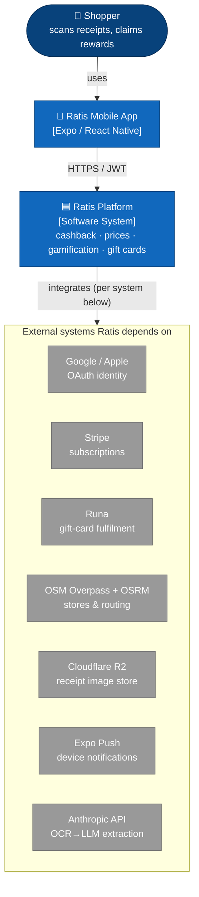
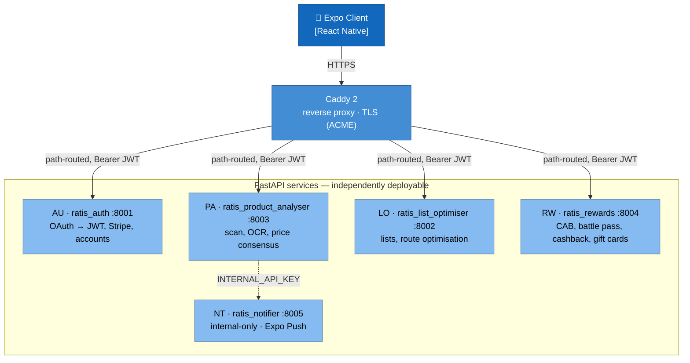
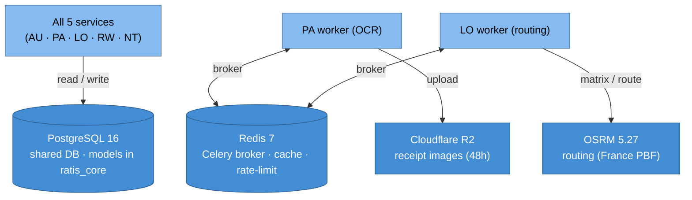
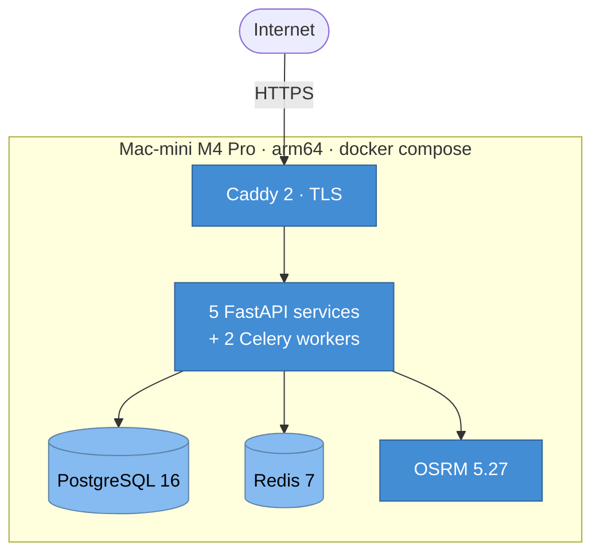
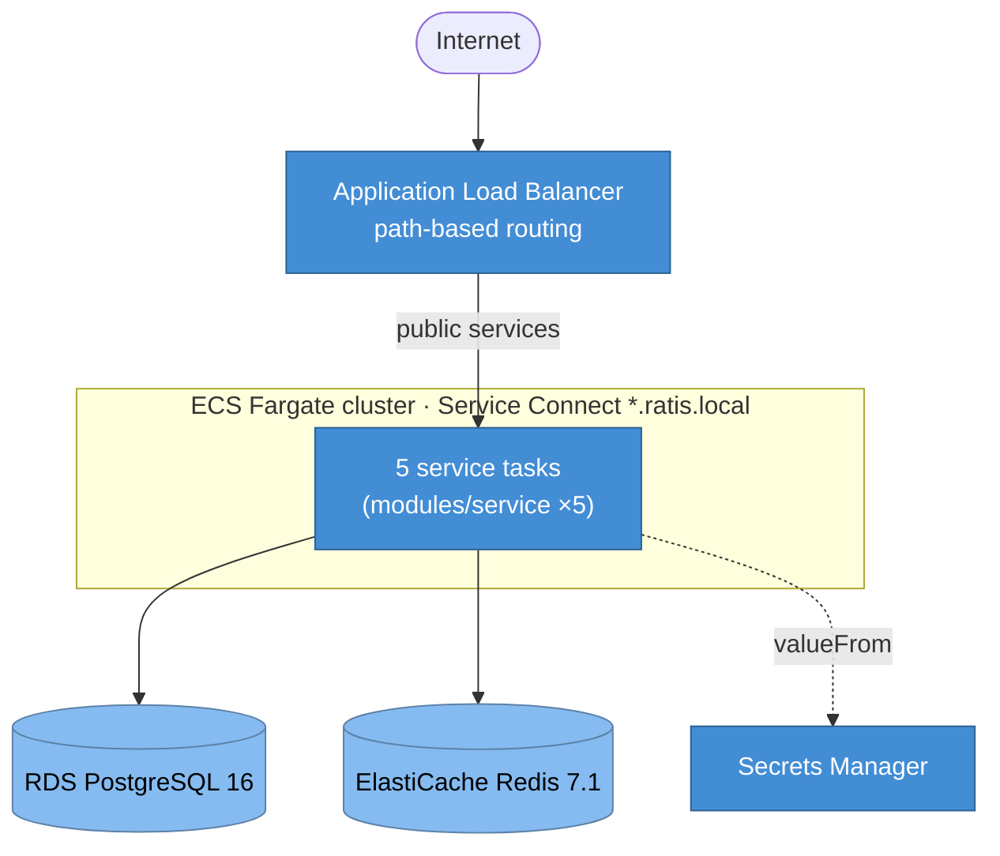
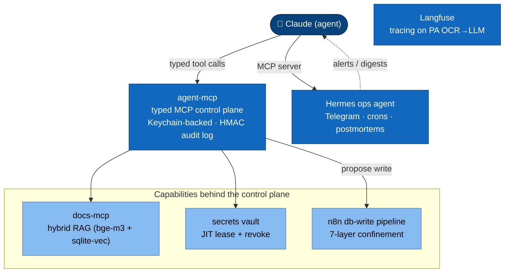

---
# Identity
type: project-root
status: in-progress

# Navigation (Obsidian + RAG)
sub_archs: [ARCH_AUTH, ARCH_PRODUCT_ANALYSER, ARCH_LIST_OPTIMISER, ARCH_REWARDS, ARCH_NOTIFIER, ARCH_CORE, ARCH_CLIENT, ARCH_BATCH_CONSENSUS, ARCH_BATCH_LEADERBOARD, ARCH_BATCH_OFF_SYNC, ARCH_BATCH_PURGE, ARCH_BATCH_RECONCILIATION, ARCH_BATCH_OSM_SYNC, ARCH_BATCH_MYSTERY_ANNOUNCE, ARCH_BATCH_REFERRAL_PAYOUT, ARCH_BATCH_SAVINGS]
related: [ARCH_deployment, WELL_ARCHITECTED, ARCH_cab_economy, ARCH_referral, ARCH_ocr_store_detection, ARCH_admin_endpoints, ARCH_admin_settings, ARCH_anti_fraud, ARCH_llm_observability, ARCH_agent_mcp, ARCH_agent_mcp_isolation, ARCH_n8n_pipelines, ARCH_hermes_ops, ARCH_incident_management, ARCH_doc_system]

# Technical
tech: [FastAPI, PostgreSQL, Redis, Celery, Expo, React Native, Docker, Caddy, Terraform, AWS, PaddleOCR, OSRM, OAuth, JWT, Stripe, Runa, Anthropic, Langfuse, MCP]
tables: []
env_vars: []

# Business
tags: [ratis, overview, project, c4, architecture]
business_domain: infra
rgpd_concern: true

# Freshness (MANDATORY — R41)
updated: 2026-06-24
---

# Ratis — System Architecture (root)

> Top-level system-architecture reference for Ratis: a production-grade cashback + real-time-price + gamification platform built as five FastAPI microservices, an Expo/React-Native app, and Terraform/AWS IaC, operated by a bespoke agentic-AI control plane. This document carries the C4 model (System Context, Container, Deployment) plus the agentic-layer view, and points to the detailed per-domain ARCHs.
> @tags: ratis overview project c4 architecture root system-context container deployment agentic stack microservices
> @status: EN-COURS
> @subs: auto

> Project root · service sub-ARCHs: [[ARCH_AUTH]] · [[ARCH_PRODUCT_ANALYSER]] · [[ARCH_LIST_OPTIMISER]] · [[ARCH_REWARDS]] · [[ARCH_NOTIFIER]] · library + client: [[ARCH_CORE]] · [[ARCH_CLIENT]] · cross-cutting: [[ARCH_deployment]] · [[WELL_ARCHITECTED]] · [[ARCH_llm_observability]] · [[ARCH_agent_mcp]] · [[ARCH_n8n_pipelines]] · [[ARCH_hermes_ops]]

## Index

- [RA-1 One-line summary · overview](#ra-1)
- [RA-2 C4 System Context · the big picture](#ra-2)
- [RA-3 C4 Container · the five services and their backing stores](#ra-3)
- [RA-4 C4 Deployment · single-host today vs AWS target](#ra-4)
- [RA-5 Agentic AI layer · the control plane](#ra-5)
- [RA-6 Key architecture decisions · trade-offs](#ra-6)
- [RA-7 Principal request flows · runtime](#ra-7)
- [RA-8 Quality attributes & GDPR posture](#ra-8)
- [RA-9 Service & batch catalogue · pointers](#ra-9)

---

## RA-1 — One-line summary · `CLAUDE.md ## identity` · EN-COURS

> TL;DR Ratis is a mobile app (Expo/React Native) backed by 5 FastAPI web services and 9 Python cron batches, delivering real cashback, OCR-sourced real-time product prices, a non-sellable gamification currency (cabecoin / CAB + battle pass), and — from V1 onward, post-Runa KYB — free gift cards funded by affiliate partnerships.
> @tags: summary identity vision cashback prices gamification gift-cards
> @subs: auto

Ratis solves four user problems in a single app:

- **Cashback** — eligible purchases are detected automatically on scanned receipts (retailer + product + price) and credited as real euro cashback, withdrawable as a gift card.
- **Real-time prices** — a per-`(store × product)` price consensus is maintained from user scans and published in the product screen so users can compare nearby retailers.
- **Gamification (cabecoin / CAB + battle pass)** — a non-sellable virtual currency (CAB) rewards every contribution action (scan, streak, mission, referral), with a seasonal battle pass.
- **Gift cards (V1, post-Runa KYB)** — accumulated cashback is exchanged for gift cards via the Runa provider, with a 30-day anti-churn hold on referral rewards.

Out of V1 but on the roadmap: a "Treasure discovered" mode (1000-point bonus + paid OpenFoodFacts contribution on each scan of an unreferenced product) and a B2B aggregated price/behaviour analytics offering. Red lines that constrain every design choice: **never sell CAB**, **never offer paid ranking** in the price screen, **never break fire-and-forget** (every user action is asynchronous server-side).

## RA-2 — C4 System Context · `docs/portfolio/BLUEPRINT.md §3` · EN-COURS

> TL;DR Level-1 C4 view: one human actor (the shopper) drives the Expo mobile app, which talks to a single "Ratis Platform" boundary; the platform integrates eight external systems (Google/Apple OAuth, Stripe, Runa, OSM + OSRM, Cloudflare R2, Expo Push, Anthropic).
> @tags: c4 system-context level1 external-systems boundary integrations
> @subs: auto

The C4 diagrams below are authored as **GitHub-native Mermaid `flowchart`** (no plugin, renders inline) and emulate C4 notation with styled nodes plus an explicit legend (the `C4Context` Mermaid dialect is intentionally avoided — it renders unreliably on GitHub).

**Legend** — dark blue = person · blue = Ratis-owned system · grey = external dependency. The platform is drawn as one boundary at this level (RA-3 zooms into its containers); the single `integrates` arrow fans out, per system, as: **OAuth** → verify `id_token` · **Stripe** → billing webhooks · **Runa** → redeem cashback to gift cards · **OSM/OSRM** → geocode stores & compute routes · **R2** → store 48h receipt images · **Expo Push** → device notifications · **Anthropic** → OCR→LLM field extraction.

## RA-3 — C4 Container · `webservices/` · EN-COURS

> TL;DR Level-2 C4 view: the Expo client calls five independently deployable FastAPI services through Caddy; PA and LO each run a separate Celery worker; all services share one PostgreSQL 16 and one Redis 7; PA additionally uses R2 and Anthropic, LO uses OSRM. The whole backend is provisioned by Terraform (`infra/aws`).
> @tags: c4 container level2 fastapi celery postgres redis caddy terraform aws-boundary
> @subs: auto

To respect the readability budget (≤8 nodes / ≤6 relationships per view), the container picture is split into **(a) request-path containers** and **(b) shared data + infrastructure**.

**(a) Request-path containers**

**(b) Shared data + worker + infrastructure**

**Legend** — blue = Expo client · medium-blue = infrastructure/proxy/data store · light-blue = a FastAPI service container · cylinder = stateful store · dashed arrow = internal-key call (not user-facing). Notes that matter:

- **AWS / Terraform boundary** — every container in views (a) and (b) except the Expo client is provisioned by `infra/aws` (one reusable `modules/service` instantiated 5×, RDS Postgres 16, ElastiCache Redis 7.1, an ALB replacing Caddy in the cloud target). See RA-4.
- **One shared database** — this is a *distributed monolith*, not fully decoupled microservices: models live in `ratis_core` and all services read/write the same Postgres. The boundaries buy independent scaling and deployment, not data isolation (see RA-6, DA-01/RA-6).
- **Celery workers are separate processes** — PA (OCR) and LO (routing) run their long tasks off the web process so the API stays responsive (fire-and-forget red line).

## RA-4 — C4 Deployment · [[ARCH_deployment]] · EN-COURS

> TL;DR Two deployment topologies coexist: the **current** single-host setup (all containers on one Mac-mini M4 Pro via docker-compose + Caddy) and the **target** AWS topology (ECS Fargate tasks behind an ALB, RDS Postgres, ElastiCache Redis, Secrets Manager) codified in `infra/aws`. The migration path Hetzner → Mac-mini → AWS is documented with explicit saturation signals.
> @tags: c4 deployment single-host mac-mini aws fargate rds elasticache terraform migration
> @subs: auto

**Current — single host (development + V0 alpha)**

**Target — AWS (`infra/aws`, eu-west-3)**

**Legend** — same colour key as RA-3 · dashed arrow = secret resolution at container start (never plaintext in the task definition). The cloud target replaces Caddy with an ALB, moves Postgres/Redis to managed RDS/ElastiCache, and resolves secrets via Secrets Manager `valueFrom`; OCR (PaddleOCR/paddlepaddle) stays off the Fargate POC because it ships no aarch64-friendly wheel under the cost-capped profile. Full topology, capacity signals, and runbook in [[ARCH_deployment]].

## RA-5 — Agentic AI layer · [[ARCH_agent_mcp]] · EN-COURS

> TL;DR The headline differentiator: a typed, Keychain-backed MCP server is the single control plane through which the LLM operates Ratis without ever touching a raw secret. Around it sit a hybrid-RAG docs index (bge-m3 + sqlite-vec), a just-in-time secrets vault, the Hermes ops agent, an n8n-confined agent→production-DB write pipeline, and Langfuse tracing on the OCR→LLM call.
> @tags: agentic mcp rag docs-mcp secrets-vault hermes n8n langfuse control-plane
> @subs: auto

**Legend** — dark blue = the agent · blue = a control-plane component · light-blue = a confined capability. The design principle is *the model never holds a raw secret and never writes to production directly*: tokens are leased just-in-time by the vault, production DB writes pass a 7-layer confinement pipeline orchestrated in n8n, and every privileged action lands in an HMAC-chained append-only audit log. Langfuse traces the single LLM call in the OCR pipeline (`claude-haiku-4-5`) and is GDPR-hard (UUID-only trace input, output capture off — see [[ARCH_llm_observability]]). Deep-dive: [[ARCH_agent_mcp]] · [[ARCH_agent_mcp_isolation]] · [[ARCH_n8n_pipelines]] · [[ARCH_hermes_ops]].

## RA-6 — Key architecture decisions · trade-offs · `docs/adr/` · EN-COURS

> TL;DR The load-bearing decisions and the quality attribute each one trades. Full decision records (MADR) live in `docs/adr/`; this is the orientation table.
> @tags: decisions adr trade-offs atam quality-attributes monorepo jwt psycopg int-cents
> @subs: auto

| # | Decision | Trade-off (attribute bought ⟶ at the cost of) |
|---|----------|-----------------------------------------------|
| DA-01 | **Monorepo uv-workspace** — one repo, one `uv.lock`, each service/batch/lib a workspace member | Consistency & shared-model simplicity ⟶ heavier CI (a `ratis_core` change rebuilds everything). Rejected: multi-repo + private package index. |
| DA-02 | **RS256 JWT, single issuer** — AU holds the private key and is the *only* issuer; AU/PA/LO/RW verify with the public key, `aud=ratis` | Blast-radius isolation (a leaked verifier can't mint tokens) ⟶ key-distribution + rotation complexity. *Supersedes the earlier shared-secret HS256 design.* |
| DA-03 | **psycopg v3 everywhere** (`postgresql+psycopg://`) | Native async + modern PG types ⟶ a silent crash if a bare `postgresql://` URL falls back to the uninstalled psycopg2 (KP). |
| DA-04 | **Money as int-cents** (rates may stay NUMERIC) | No float rounding error + fast aggregation ⟶ explicit `int(round(Decimal(str(v))*100))` conversion discipline. |
| DA-07 | **Celery workers separate from web** (PA, LO) | Fire-and-forget responsiveness (availability/perceived latency) ⟶ eventual consistency, reconciled by batch jobs. |
| DA-08 | **Explicit `db.commit()` in every mutating route** | Review-detectable correctness ⟶ rejected an auto-commit middleware that hid the test/prod rollback footgun. |
| — | **Transactional outbox over a message broker** for inter-service delivery | Operational simplicity at V0/V1 volume ⟶ no broker; revisit at the documented Mac-mini saturation threshold. |
| — | **Hetzner → Mac-mini → AWS** staged hosting | Cost control + learning value ⟶ a manual migration step at each capacity signal (see [[ARCH_deployment]]). |

Each row maps to a standalone MADR in `docs/adr/` (the canonical, append-only decision log). The R41 status vocabulary (`LIVRÉ`/`EN-COURS`/`PLANIFIÉ`/`DEPRECATED`) aligns with MADR `accepted`/`superseded`.

## RA-7 — Principal request flows · runtime · EN-COURS

> TL;DR Three flows carry most of the product: receipt scan (OCR → consensus → reward), OAuth login (id_token → RS256 JWT), and gift-card claim (atomic balance → Runa). Each is asynchronous where the work is heavy.
> @tags: flows runtime scan login gift-card celery push fire-and-forget
> @subs: auto

**Flow 1 — Receipt scan.** The client uploads the photo to `POST /api/v1/scan/receipt` (PA) → PA stores the image in R2 (48h TTL), creates a `scans.type=receipt` row as `pending`, and enqueues a Celery task → the worker runs PaddleOCR (lazy import), resolves the store via a local `pg_trgm` matcher on `stores`, extracts fields through the `claude-haiku-4-5` LLM call (Langfuse-traced), matches products, and fills `receipts.total_amount` → the scan transitions `unmatched → accepted` (or `rejected`) → `rewards_client.trigger_scan_accepted()` emits CAB and battle-pass progress in RW → NT sends an Expo push.

**Flow 2 — OAuth login.** `expo-auth-session` obtains a provider `id_token` → posted to AU → AU verifies it with Google/Apple, finds-or-creates the `users.id`, and issues an **RS256** access JWT (`aud=ratis`, 60 min) + a 30-day refresh token → subsequent calls to PA/LO/RW carry the JWT and are verified locally against the public key.

**Flow 3 — Gift-card claim.** Client calls `POST /api/v1/rewards/gift-cards/claim` (RW) → RW debits the balance atomically (`UPDATE user_cashback_balance SET balance = balance - :x WHERE user_id = :u AND balance >= :x`), inserts an idempotent `gift_card_orders` row on `(source_type, source_ref_id)`, calls Runa, stores the encrypted code → NT pushes "your gift card is ready".

## RA-8 — Quality attributes & GDPR posture · [[WELL_ARCHITECTED]] · EN-COURS

> TL;DR The non-functional spine: fire-and-forget availability, atomic materialized balances, single-issuer security, and an inflexible GDPR ruleset (no PII names, 48h receipt images, never-purge financial tables, in-place account anonymisation). The full six-pillar self-assessment lives in [[WELL_ARCHITECTED]].
> @tags: quality-attributes gdpr rgpd availability security reliability privacy
> @subs: auto

- **Availability / perceived latency** — every heavy user action is async (Celery + push); the API never blocks on OCR or routing.
- **Consistency** — materialized balance tables (`user_cab_balance`, `user_cashback_balance`) are updated atomically; cross-service effects are reconciled by batch jobs.
- **Security** — RS256 single-issuer (DA-02), secrets via Secrets Manager `valueFrom` / Keychain-backed vault, a `security.yml` CI gate (detect-secrets / gitleaks-class scanning).
- **GDPR (inflexible)** — no names/first-names stored from OCR · receipt images deleted ≤ 48h (`image_deleted_at`) · label `image_url → NULL` on accept · `user_lat`/`user_lng` are PII and never logged · `optimized_routes.steps` never includes the home point · `cashback_withdrawals` / `cashback_transactions` / `subscriptions` are **never purged** (legal) · `DELETE /account` anonymises in place. Detail in `docs/product/PRIVACY.md`.

The complete AWS Well-Architected six-pillar review (with honestly-noted gaps) is [[WELL_ARCHITECTED]].

## RA-9 — Service & batch catalogue · pointers · EN-COURS

> TL;DR The 5 services and 9 batches, each pointing to its owning ARCH. This section is a directory, not a duplication — depth lives in the linked docs.
> @tags: catalogue services batches pointers directory
> @subs: auto

**Services (5 FastAPI web services)**

- [[ARCH_AUTH]] — `ratis_auth` :8001 — OAuth Google/Apple, RS256 JWT issue/refresh, Stripe webhooks, account management, slowapi rate-limiting on sensitive routes.
- [[ARCH_PRODUCT_ANALYSER]] — `ratis_product_analyser` :8003 — receipt/label upload + OCR (PaddleOCR + pyzbar), local store matcher, price consensus, separate Celery worker, R2 image storage (48h TTL), Langfuse-traced OCR→LLM extraction.
- [[ARCH_LIST_OPTIMISER]] — `ratis_list_optimiser` :8002 — shopping lists, multi-store route optimisation via OSRM MLD (France PBF), Celery worker, 24h routes with no home point.
- [[ARCH_REWARDS]] — `ratis_rewards` :8004 — cabecoin (CAB), cashback, battle pass, missions, gift cards (Runa V1), admin endpoints behind `ADMIN_API_KEY`.
- [[ARCH_NOTIFIER]] — `ratis_notifier` :8005 — internal-only, `POST /api/v1/notify` behind `INTERNAL_API_KEY`, pushes Expo notifications.

**Batches (9 cron jobs, `batch/`)** — OSM sync, OFF sync, consensus recompute, GDPR purge, cashback reconciliation, mystery announce, leaderboard snapshot, referral payout, savings. All follow [[ARCH_BATCH_TEMPLATE]].

**Shared building blocks** — [[ARCH_CORE]] (`ratis_core`: SQLAlchemy models, JWT/auth helpers, inter-service HTTP clients, settings loader) · [[ARCH_CLIENT]] (`ratis_client`: Expo SDK 54 / React Native, four `services/*-client.ts`).
