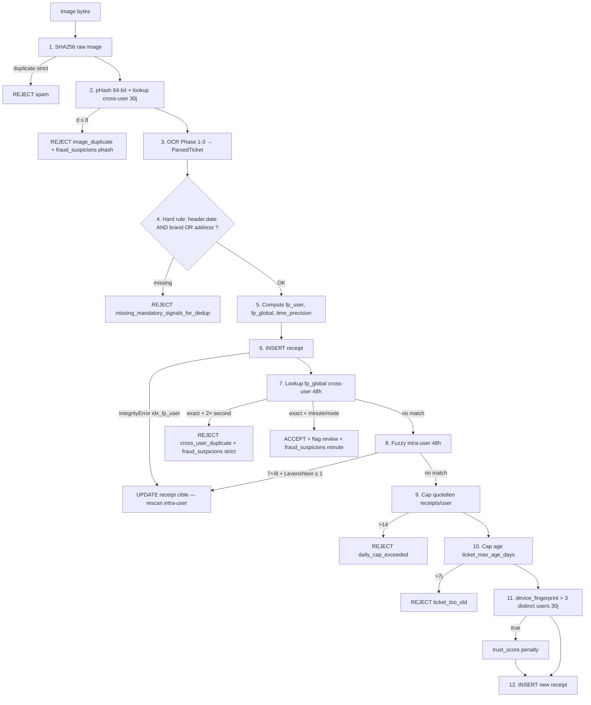

# ratis_product_analyser — ARCH Receipt Pipeline (v3, redesign)

> Planned redesign of the receipt pipeline (image → structured DB data) with a single contract, zero silent drops, and full traceability. Built in parallel with the existing pipeline following audit PR #191 (28 silent drops, including 8 on the alpha receipt).
> @tags: pipeline receipt ocr parsing matching knowledge contract-test redesign v3 silent-drop audit planned 2026-04-30
> @status: PLANIFIÉ
> @subs: auto

> Parent : [[ARCH_PRODUCT_ANALYSER]] · Relations : [[ARCH_OCR_LLM_BRIDGE]], [[ARCH_store_resolution]], [[ARCH_store_validation]], [[ARCH_consensus]], [[ARCH_cashback]]

> Status : 📋 **Planned** — redesign design 2026-04-30 following pipeline audit (PR #191) which revealed 28 silent drops, 8 of which impact the Intermarché Courbevoie alpha receipt. The current code remains in place while v3 is built in parallel.

> **Genesis** — the current pipeline has accumulated layers without a global contract. Each PR (preprocessing v2, fuzzy hardening, LLM v2, store validation) optimized locally, and the combined result silently drops 27 out of 28 cases — with no DB logs, no Sentry, indistinguishable from each other. This ARCH establishes the single contract before any refactor.

---

## Pipeline mission (immutable)

> **Transform a receipt image into accurate, persisted, traceable structured DB data, with no data ever silently lost.**

That's it. **Explicit out-of-scope**: cashback. The cashback calculation is a separate batch that reads the `receipts` table after the pipeline. The pipeline never triggers any credit.

---

## Index

- [Pipeline mission (immutable)](#pipeline-mission-immutable)
- [The 4 phases](#the-4-phases)
  - [Phase 1 — Extract](#phase-1--extract)
  - [Phase 2 — Understand](#phase-2--understand)
  - [Phase 3 — Match](#phase-3--match)
  - [Phase 4 — Persist](#phase-4--persist)
- [Knowledge tables — auto-learning](#knowledge-tables--auto-learning)
- [User resolution — physical barcode only](#user-resolution--physical-barcode-only)
- [Target DB schema](#target-db-schema)
- [Contract test — the oracle](#contract-test--the-oracle)
- [Out-of-scope — cashback (separate batch)](#out-of-scope--cashback-separate-batch)
- [Migration plan from the old pipeline](#migration-plan-from-the-old-pipeline)
- [Receipt reconciliation — V1 (dual fingerprint + pHash + admin queue)](#receipt-reconciliation--v1-dual-fingerprint--phash--admin-queue)
- [Explicitly forbidden anti-patterns](#explicitly-forbidden-anti-patterns)

---

## The 4 phases

```
[Image bytes]
     │
     ▼
[1.Extract]            ─→ ocr_knowledge / product_knowledge
     │ RawTicket          (read-only consultation)
     ▼
[2.Comprendre]         ─→ ocr_knowledge (read+write)
     │ ParsedTicket
     ▼
[3.Matcher]            ─→ product_knowledge (read+write) + stores (read)
     │ MatchedTicket
     ▼
[4.Persister]          ─→ DB tables : receipts, scans, store_candidates, parsed_tickets
     │
     ▼
   DB final state
```

### Phase 1 — Extract

**Mission**: extract raw text and the barcode from the image. **No business logic decisions**.

**Input**
- `image_bytes` (JPEG/PNG)

**Output** (typed Pydantic object, not yet persisted in the primary DB but written to `parsed_tickets.raw_blocks_jsonb` immediately):

```python
class RawBlock(BaseModel):
    text: str
    bbox: tuple[float, float, float, float]  # (x, y, w, h)
    confidence: float

class RawTicket(BaseModel):
    blocks: list[RawBlock]
    barcode_pyzbar: str | None  # tentative pyzbar, None si fail
    image_quality: ImageQuality  # blurry/clean/etc.
```

**Guarantees**:
- If `image_quality == ImageQuality.UNREADABLE` → pipeline stops here, `receipt.status = 'rejected'`, `rejected_reason = 'image_unreadable'`. Traced in DB.
- No OCR block is dropped at this phase. All PaddleOCR blocks are kept as-is.
- `barcode_pyzbar = None` if pyzbar fails — an OCR-pattern fallback will be attempted in Phase 2.

**What changes vs. now**:
- `image_quality` is no longer a silent exception — it is an explicit state with `rejected_reason`.
- `parsed_tickets.raw_blocks_jsonb` is written HERE, not at the end of the pipeline. If Phase 2/3/4 crashes, we can replay from Phase 1 without re-running OCR.

---

### Phase 2 — Understand

**Mission**: transform raw blocks into a semantic structure (header, items, footer). **Every OCR'd block gets exactly ONE final category**.

**Input**: `RawTicket`

**Output**:

```python
class HeaderField(BaseModel):
    raw: str           # ce que l'OCR a vu
    normalized: str    # corrigé par LLM ou knowledge
    confidence: float

class ParsedHeader(BaseModel):
    brand: HeaderField | None
    address_full: HeaderField | None
    postal_code: str | None
    city: str | None
    phone_e164: str | None
    siret: str | None
    date: datetime | None

class ParsedItem(BaseModel):
    raw_text: str           # OCR raw du nom
    normalized_text: str    # LLM corrigé
    quantity: int | None
    unit_price_cents: int | None
    total_price_cents: int | None
    unit_type: Literal['unit', 'kg', 'l'] | None
    position_y: float
    parsing_status: Literal['complete', 'partial']
    parsing_issues: list[str]  # ex: ['no_price_nearby', 'qty_inferred_from_total']

class ParsedFooter(BaseModel):
    total_ttc_cents: int | None
    vat_breakdown: list[VatLine]
    payment_method: str | None
    barcode: str | None  # priorité pyzbar > OCR fallback
    item_count_declared: int | None  # "Nombre d'articles vendus"

class ParsedTicket(BaseModel):
    header: ParsedHeader
    items: list[ParsedItem]
    footer: ParsedFooter
    quality_score: float  # mean confidence
    parse_consistency: ParseConsistency  # {sum_items == total_ttc, item_count == declared}
    unclassified_clusters: list[ClusterInfo]  # blocks LLM n'a pas classé — JAMAIS vide-et-perdu
```

**Guarantees**:
- **No cluster without a category**. If the LLM does not classify a cluster → it lands in `unclassified_clusters` with its raw_text intact. **Never a silent drop**.
- **No OCR'd item lost**. If an item fails to parse (no nearby price, missing qty) → `parsing_status='partial'` + `parsing_issues=[...]` + all partial data is kept.
- **Tolerant total extraction**. Recognizes `MONTANT DU`, `TOTAL TTC`, `MT.TTC`, `RESTE A PAYER`, `TOTAL ELIGIBLE`. If the LLM misclassifies them → legacy regex fallback is triggered.
- **Consistency cross-check**. `sum(items.total_price_cents)` vs `footer.total_ttc_cents` computed internally, flagged on mismatch — does not block, just logged in `parse_consistency`.

**Knowledge integration (read)**:
- BEFORE LLM call: for each block, lookup `ocr_knowledge`:
  - If `block.text` is known as `category='dismissal'` → skip LLM (saves tokens)
  - If known as a determined category → assign directly
- LLM only processes genuinely unknown blocks

**Knowledge integration (write)**:
- AFTER LLM: INSERT new raw_text → category mappings learned into `ocr_knowledge`

**Intermediate persistence**: `parsed_tickets.parsed_jsonb` written HERE. This is the **cardinal state**. If Phase 3/4 crashes or is updated, we can replay from this state without re-running OCR + LLM.

---

### Phase 3 — Match

> **Bloc 6 status (2026-04-30 + refactor 2026-05-02) — DONE.** Implemented
> in `webservices/ratis_product_analyser/worker/pipeline/match.py` +
> 31 tests (`tests/pipeline/test_match.py`). Pure-functional, DB I/O
> via `Protocol` callbacks (`ProductByEanLookup` /
> `ProductByKnowledgeLookup` / **`ConsensusExactLookup`** /
> **`ConsensusFuzzyLookup`** / `StoreLookup`) — the orchestrator wires these to the DB.
>
> **Consensus-only refactor (2026-05-02)**: the
> `barcode → knowledge → fuzzy_strict` cascade was replaced by
> `barcode → knowledge curated → consensus exact → consensus fuzzy →
> STOP`. No more fuzzy product-name matching against `products` —
> only a VERIFIED consensus yields a positive EAN. Satisfies
> `ARCH_name_resolution_consensus.md` § "Philosophy".
>
> Technical decisions:
> - **MatchMethod** = `Literal["barcode", "knowledge", "consensus_match"]`
>   (drop `fuzzy_strict` on the pipeline side; the value remains in the DB
>   CHECK for back-compat — physical drop = data migration follow-up).
> - **`fuzzy_threshold` / `fuzzy_auto_accept` removed**: only
>   `store_threshold` (0.80) and `store_suggest_floor` (0.50) remain.
> - **Barcode unknown ≠ consensus fallback**: if an item carries an
>   explicit barcode but the EAN is not in the DB, status=unresolved
>   with `rejected_reason='barcode_unknown_in_db'`. The consensus
>   fallback is NOT attempted — an explicit canonical key must
>   never be silently overridden.
> - **Without store_id, no consensus**: the cascade stops at step
>   3 if the store could not be resolved (the ledger is keyed on
>   `(store_id, normalized_label)`). `rejected_reason='no_store_for_consensus'`.
> - **`consensus_state` recorded in `DecisionInputs`**: `"VERIFIED"` /
>   `"PENDING"` / `"CONTROVERSE"` / `"UNVERIFIED"` according to what was
>   found in the ledger. `None` if the consensus branch was not
>   reached (barcode or knowledge hit, or no store).
> - **Store match: 3 statuses**: `matched` (>= 0.80), `suggested`
>   (0.50–0.80), `unresolved` (< 0.50). The `suggested` band is
>   the input to Phase 4 for creating `store_candidates`.
> - **`top_candidates` capped at 5** at both the module level AND the type
>   level (Pydantic invariant); in practice the consensus-only cascade emits
>   at most 1 candidate per match (the verified leader).
> - **Verbose per-item audit**: opt-in via `log_level='verbose'`,
>   payload contains `parsed_item_id`, `match_id`, `status`,
>   `match_method`, `match_confidence`, `rejected_reason`,
>   `candidates_considered`. `normal` / `production` emit only
>   `match_started` + `match_completed` (compact).

**Mission**: associate each parsed entity (store, items) with a canonical identifier. **No item without an explicit status**.

**Input**: `ParsedTicket`

**Output**:

```python
class StoreMatch(BaseModel):
    status: Literal['confirmed', 'pending', 'unknown']
    store_id: UUID | None
    candidate: StoreCandidate | None  # populé si status != 'confirmed'

class ItemMatch(BaseModel):
    item: ParsedItem
    status: Literal['matched', 'unresolved', 'rejected']
    match_method: Literal['barcode_ean', 'knowledge', 'fuzzy_high_confidence'] | None
    chosen_ean: str | None
    top_candidates: list[Candidate]  # toujours stocké pour audit, JAMAIS exposé à l'user
    rejected_reason: str | None  # non-null si status='rejected'

class MatchedTicket(BaseModel):
    parsed: ParsedTicket  # référence au state input
    store_match: StoreMatch
    item_matches: list[ItemMatch]
```

**Product matching rules — consensus-only refactor 2026-05-02** (order, first hit wins):
1. **Strict barcode**: if `item.barcode` is non-null, direct lookup in `products` by EAN. Hit → `status='matched'`, `match_method='barcode'`, `match_confidence=1.0`. Miss → `status='unresolved'`, `rejected_reason='barcode_unknown_in_db'` (NO consensus fallback — an explicit canonical key must never be silently overridden).
2. **Knowledge curated lookup**: if no barcode, lookup `ProductKnowledgeLookup` by `normalized_label`. Returns a hit only when the mapping is *curated* (admin-validated or auto-promoted via VERIFIED consensus). Hit → `match_method='knowledge'`.
3. **Exact consensus**: if no store_id, STOP with `rejected_reason='no_store_for_consensus'`. Otherwise, look up the `product_name_resolutions` ledger for `(store_id, normalized_label)`. If the derived state is `VERIFIED` → `match_method='consensus_match'` with the leader EAN (top1).
4. **Fuzzy consensus**: if the exact lookup misses, fuzzy fallback on the ledger: `ABS(LENGTH(label) - LENGTH(cleaned_label)) <= 2` AND `similarity > 0.80` among `VERIFIED` entries for the store. Catches OCR variants not yet corrected by `ocr_knowledge`. Hit → `match_method='consensus_match'`.
5. **STOP**: if no VERIFIED consensus → `status='unresolved'`, `match_method=None`. `rejected_reason='no_consensus'` or `'consensus_state_<lowercase>'` (`pending` / `controverse` / `unverified`) depending on what the ledger returned.

**No product-level fuzzy matching against `products`** — the consensus-only philosophy (refactor 2026-05-02 — cf. `ARCH_name_resolution_consensus.md` § "Philosophy") completely forbids matching by OFF/internal product names to avoid false positives (e.g., 30+ generic "Hipro" items tagged randomly).

**Store matching rules**: already documented in [[ARCH_store_validation]] and [[ARCH_store_resolution]]. No changes here.

**Guarantees**:
- Every `ParsedItem` produces exactly one `ItemMatch`. No drops, no ignored items.
- No `match_method='ambiguous'` — it is `'unresolved'` or nothing. No silent near-match.
- `top_candidates` always stored when relevant (useful for auditing, future ML training, but **strictly read-only-internal**).

**Formally forbidden anti-pattern**:
- ❌ `if ambiguous: return None` (current PR #176) — **prohibited**.
- ❌ Surfacing candidates in the UI for the user to pick — **prohibited** (cf. § User resolution).

---

### Phase 4 — Persist

> **Bloc 7 status (2026-04-30) — DONE.** See PR #201:
> `worker/pipeline/persist.py` (Phase 4) + `orchestrator.py`
> (composes 4 phases + DB lookups) + `llm_clients.py` (Anthropic +
> Stub). 38 passing tests (12 persist DB-integration + 11 orchestrator +
> 15 llm_clients), contract test skip-on-FILL_ME activated.
>
> Technical decisions made along the way:
> - **Receipt FK ordering**: `parsed_tickets.receipt_id → receipts(id)`
>   is checked at INSERT, so the persist sequence is (1) UPSERT
>   receipt with `parsed_ticket_id=NULL`, (2) UPSERT parsed_ticket,
>   (3) UPDATE `receipts.parsed_ticket_id`. Idempotent on re-run.
> - **LLM env vars**: reuse of `LLM_API_KEY` / `LLM_MODEL`
>   (consistent with `worker/pipeline/llm_clients.py`).
>   No new env var. Default model: `claude-haiku-4-5`.
> - **Store status mapping**: v3 `matched/suggested/unresolved` → DB
>   `confirmed/pending/unknown`. The CHECK `scans.store_status='unknown'
>   iff store_id IS NULL` is enforced by the persist layer (automatic
>   downgrade on scans).
> - **Audit log best-effort**: a failed INSERT into audit_log is logged
>   as WARNING and swallowed — the pipeline never crashes on an
>   audit write (per ARCH § Traceability).
> - **`parsing_issues` mapping**: the orchestrator emits an audit event
>   `item_has_parsing_issues` but does NOT pre-reject the item (Phase 3
>   remains the decision-maker). DP entry candidate if product wants the
>   strict `parsing_issues → status=rejected` mapping.
> - **`product_knowledge` no-op lookups**: the `product_knowledge`
>   table was renamed → `ocr_knowledge` with a different schema (no more
>   label → EAN mapping). v3 loaders return `None` until
>   a real `(store_id, normalized_label) → EAN` table is created
>   (post-bloc-7). Documented inline.

**Mission**: write all data to the DB with a strict contract. No silent NULLs.

**Input**: `MatchedTicket`

**DB side effects** (single transaction unless batch is too large — then explicit checkpoints):

#### `receipts` — always written, all parsed fields
```sql
UPDATE receipts SET
  store_id = matched.store_match.store_id,           -- nullable, normal si unknown
  store_status = matched.store_match.status,         -- enum non-null
  total_amount_cents = parsed.footer.total_ttc_cents,-- jamais NULL silencieux : si parsing fail, écrit 0 + parsing_flags
  receipt_barcode = parsed.footer.barcode,           -- pyzbar OU OCR fallback
  payment_method = parsed.footer.payment_method,
  scanned_at = parsed.header.date,
  parsing_flags = jsonb_build_object(
    'parse_consistent', parsed.parse_consistency.is_consistent,
    'total_inconsistent_delta_cents', parsed.parse_consistency.delta_cents,
    'image_quality_score', parsed.quality_score,
    'has_unclassified_clusters', length(parsed.unclassified_clusters) > 0
  ),
  parsed_ticket_id = parsed_tickets.id  -- FK audit trail
WHERE id = receipt_id;
```

#### `scans[]` — one per item, never lost
```sql
INSERT INTO scans (
  receipt_id, scan_type, status, rejected_reason,
  scanned_name, normalized_name, quantity, price_cents, total_price_cents,
  match_method, product_ean,
  top_candidates_jsonb,                  -- toujours stocké pour audit
  parsing_issues_jsonb                   -- ['no_price_nearby', etc.]
) VALUES ( ... );
```

**`scans.status` enum contract**:
- `'matched'` → `match_method` non-null, `product_ean` non-null, `rejected_reason` NULL
- `'unresolved'` → `match_method` NULL, `product_ean` NULL, `rejected_reason='requires_user_barcode'`
- `'rejected'` → `match_method` NULL, `product_ean` NULL, `rejected_reason ∈ ('no_qty', 'no_price', 'ocr_garbage', 'duplicate_receipt', 'image_unreadable')`

**INVARIANT**: `status != 'matched' ⟹ rejected_reason IS NOT NULL`. Enforced by DB CHECK constraint.

#### `store_candidates` — if store is unknown or pending
Best-effort, populated with available data, flag `completeness ∈ ('full', 'partial')`. Cf [[ARCH_store_validation]].

#### `parsed_tickets` — immutable audit trail
1 JSONB row with `raw_blocks`, `parsed`, `matched` complete. **Never updated**, immutable. Allows replaying the entire pipeline from any phase if a downstream bug is discovered.

**Guarantees**:
- No silent NULLs: all fields have either a value or an explicit flag in `parsing_flags`.
- No item lost: `scans.count` = `parsed.items.count` (assertion tested).
- Complete audit trail: for any receipt, the exact history can be reconstructed via `parsed_tickets`.

---

## Knowledge tables — auto-learning

### `ocr_knowledge` (already exists, to be formalized)

```
raw_text (PK) → category, confidence, source, last_seen
```

- `category`: `header` | `item_name` | `item_price` | `total` | `vat` | `payment` | `dismissal` | `barcode` | `unknown`
- `source`: `llm` | `regex` | `manual_admin`
- Read: Phase 2 before LLM call, short-circuits known boilerplate
- Write: Phase 2 after LLM, memorizes new mappings

### `product_knowledge` (already exists, to be formalized)

```
(store_id, raw_text) (composite PK) → product_ean, confidence, source, last_used
```

- `source`: `user_barcode_scan` (confidence=1.0) | `fuzzy_high_confidence` (≥0.7, ≤0.95) | `manual_admin` (1.0)
- Read: Phase 3 before fuzzy, short-circuits if mapping is known
- Write: Phase 3 after match (auto if fuzzy_high_confidence) + after user barcode resolution

### Learning loop (closed loop)

```
1er scan ticket → fuzzy ambigu → status='unresolved'
        ↓
User scan barcode physique du produit (Résolution user, cf. §)
        ↓
INSERT product_knowledge source='user_barcode_scan' confidence=1.0
        ↓
2ème scan même item chez même store
        ↓
Phase 3 lookup product_knowledge → match direct → status='matched'
        ↓
Plus jamais de friction sur cet item.
```

**The user resolves an item once per product, never twice.**

---

## User resolution — physical barcode only

> **Absolute principle**: the user is never a reliable source of truth when picking from a list. To resolve an `unresolved` item, they must prove they physically hold the product by scanning its barcode.

### Flow

1. User views scan-history → sees items with a 🔴 icon (status='unresolved')
2. Tap icon → opens the barcode scanner camera (`BarcodeScannerModal` component, already in place via PR #178)
3. User physically retrieves the product (fridge, bag, cabinet) and scans the barcode
4. Frontend `POST /api/v1/scan/barcode { scan_id, ean }`
5. Backend validates:
   - Does `ean` exist in `products`?
     - No → 404 `product_not_found`, user can retry
     - Yes → continue
   - Is the parsed item consistent with this product? (soft heuristic: token similarity > 0.5 between `parsed_item.raw_text` and `product.name` after unaccent+lower normalization)
     - Consistent → accept
     - Inconsistent → 422 `product_mismatch` (the user is trying to match something completely different — anti-fraud)
6. Backend updates:
   - `UPDATE scans SET status='matched', match_method='user_barcode_scan', product_ean=:ean, rejected_reason=NULL`
   - `INSERT product_knowledge (store_id, raw_text, product_ean, source='user_barcode_scan', confidence=1.0)`
7. UI item turns green. Resolved permanently.

### Why this is solid

- **Anti-fraud**: the user must physically have the product. Hard to fake.
- **No user error**: barcode = canonical, no typo possible, no "I clicked the wrong one".
- **Clean knowledge**: `source='user_barcode_scan'` confidence=1.0 = real ground truth.
- **Friction = filter**: a user scanning 100 fake products is a detectable anomaly. A fraudster won't physically handle 100 products.

### Forbidden anti-patterns

- ❌ Picker UI showing top-N candidates for the user to choose from. **Never**.
- ❌ Free-text entry of product name by the user. **Never**.
- ❌ User confirmation of an automatic suggestion ("is this the right product?"). **Never**. The system either KNOWS, or asks for a physical barcode.

---

## Target DB schema

### Migrations to perform

> **Bloc 2 status (2026-04-30) — DONE.** See PR #195:
> migration `20260430_1000_pipeline_v3_clean.py` + ORM models
> `ratis_core/models/pipeline_v3.py` + 18 invariant tests
> (`webservices/ratis_product_analyser/tests/pipeline/test_migration.py`)
> + 10 alembic upgrade/downgrade tests (`alembic/tests/test_pipeline_v3_migration.py`).
> DA-36 (truncate alpha cashback/cabecoin override) acted in `DECISIONS_ACTED.md`.
> DP-04 (polymorphic FK on `cabecoin_transactions.reference_id`) flagged for
> a focused post-pipeline-v3 bloc (recorded in `DECISIONS_PENDING.md`).
>
> Technical decisions made along the way:
> - **Superset enum**: status + match_method retain the v2 legacy values
>   (`accepted` / `unmatched` / `failed` ; `observed_name` / `fuzzy` / …) in
>   addition to v3 values — transitional, bloc 8 will drop the legacy ones.
> - **`'failed'` legacy status**: added to the superset because the v2 worker writes it
>   even though it was never in the legacy CHECK enum (silent test/prod gap).
> - **`immutable_unaccent` wrapper**: PG `unaccent()` is STABLE (≠ IMMUTABLE
>   required by GENERATED columns) — SQL function wrapper pattern from PG docs.
> - **Prod bug surfaced**: `worker/receipt_task.py:1873` was creating scans
>   with `status='rejected'` without `rejected_reason` — invalid for the legacy
>   AND v3 CHECK, but `create_all` tests had never caught it. Fixed.

1. **New `parsed_tickets` table** (immutable JSONB audit trail)
   ```sql
   CREATE TABLE parsed_tickets (
     id UUID PRIMARY KEY DEFAULT gen_random_uuid(),
     receipt_id UUID NOT NULL REFERENCES receipts(id),
     raw_blocks_jsonb JSONB NOT NULL,
     parsed_jsonb JSONB NOT NULL,
     matched_jsonb JSONB NOT NULL,
     created_at TIMESTAMPTZ DEFAULT now() NOT NULL
   );
   CREATE INDEX idx_parsed_tickets_receipt ON parsed_tickets(receipt_id);
   ```

2. **`scans.rejected_reason`**: full enum + CHECK constraint
   ```sql
   ALTER TABLE scans ADD CONSTRAINT scans_status_reason_invariant
     CHECK (
       (status = 'matched' AND match_method IS NOT NULL AND product_ean IS NOT NULL AND rejected_reason IS NULL)
       OR (status = 'unresolved' AND match_method IS NULL AND product_ean IS NULL AND rejected_reason IS NOT NULL)
       OR (status IN ('rejected', 'pending', 'accepted') AND rejected_reason IS NOT NULL OR rejected_reason IS NULL)
     );
   ```
   *(to be refined with the SA — the intent is: `status != 'matched' ⟹ rejected_reason NOT NULL`)*

3. **`scans.top_candidates_jsonb`** + `scans.parsing_issues_jsonb` (new fields)

4. **`receipts.parsing_flags`** JSONB nullable

5. **`receipts.parsed_ticket_id`** FK to `parsed_tickets`

6. **`unaccent` extension** + `name_normalized` GENERATED columns on `products`/`stores`/`store_candidates` (cf previous discussion on canonical fuzzy match)

7. **`ocr_knowledge`**: audit current schema + align `category` enum

8. **`product_knowledge`**: audit + add `source` enum + `confidence` numeric + `last_used` timestamp

---

## Contract test — the oracle

> **One inviolable rule**: for each type of real receipt tested in alpha, there is a fixture (image + expected DB state). The contract test does: upload image → run full pipeline → assert all DB rows match expected.

### Structure

```
tests/fixtures/receipts/
  intermarche_courbevoie_2026_04_22/
    image.jpg                      # le ticket réel
    expected_receipt.json          # state DB attendu
    expected_scans.json            # liste scans attendus
    expected_store_candidate.json  # candidate attendu
    expected_parsed_ticket.json    # ParsedTicket attendu (cardinal state)
  monoprix_republique_2026_04_xx/
    ...
  carrefour_menilmontant_2026_04_27/
    ...
```

### The test (Python pytest)

```python
@pytest.mark.parametrize("fixture_dir", ALL_RECEIPT_FIXTURES)
def test_pipeline_contract(fixture_dir, db_session, mock_llm):
    # Setup
    image_bytes = (fixture_dir / "image.jpg").read_bytes()
    expected_receipt = json.loads((fixture_dir / "expected_receipt.json").read_text())
    expected_scans = json.loads((fixture_dir / "expected_scans.json").read_text())
    
    # Act : run pipeline complet (Phase 1 → 4)
    receipt_id = process_receipt_pipeline(image_bytes, user_id=test_user_id, db=db_session)
    
    # Assert : DB state matches expected
    receipt = db_session.get(Receipt, receipt_id)
    assert_receipt_matches(receipt, expected_receipt)
    
    scans = db_session.scalars(select(Scan).where(Scan.receipt_id == receipt_id)).all()
    assert len(scans) == len(expected_scans)
    for scan, expected in zip(sorted(scans, key=lambda s: s.position_y), expected_scans):
        assert_scan_matches(scan, expected)
    
    # Critical check: no item lost
    assert len(scans) == count_items_in_parsed(fixture_dir)
```

### Discipline

- **No PR can be merged if the contract test fails.** R15 strengthened.
- **No PR can modify a contract test assertion without written justification in the commit message.** If you change `expected_receipt.total_amount_cents = 1876` to `expected_receipt.total_amount_cents = NULL` to make the test pass, that is a red flag and the reviewer must block.
- **Each alpha bug discovered → add a fixture.** Coverage grows with usage.
- **Cross-link CLAUDE.md**: R35 (to be created) — *"Contract tests are the oracle. Tests asserting buggy behavior are forbidden. Modifications to contract test assertions require explicit reasoning in commit + reviewer approval."*

---

## Out-of-scope — cashback (separate batch)

The pipeline never touches CAB tables. The cashback calculation is delegated to a separate batch that:
1. Reads receipts with `store_status='confirmed'` AND all scans with `status='matched'`
2. Applies business rules (% per retailer, caps, etc.)
3. Writes to `cashback_transactions`

Not covered in this ARCH. See [[ARCH_cashback]] for batch details.

---

## Traceability — end-to-end fingerprint

> **Principle**: every OCR'd piece of data has a **fingerprint** (UUID + content hash) born in Phase 1 and propagated all the way to the final DB. At any point, from any DB row, it must be possible to trace back to the source OCR blocks and vice versa.

### Fingerprints per phase

#### Phase 1 — each RawBlock born with UUID + content hash

```python
class RawBlock(BaseModel):
    block_id: UUID = Field(default_factory=uuid4)        # né ici, immutable
    text: str
    bbox: tuple[float, float, float, float]
    confidence: float
    content_hash: str  # sha256(f"{text}|{bbox}|{confidence:.4f}")
```

The `content_hash` makes it possible to detect regressions: if the same OCR block reproduced at two different dates has a different hash, something upstream changed (PaddleOCR version, preprocessing, etc.).

#### Phase 2 — ParsedItem references its sources

```python
class ParsedItem(BaseModel):
    item_id: UUID = Field(default_factory=uuid4)         # né ici
    raw_text: str
    source_block_ids: list[UUID]                         # les RawBlock.block_id qui ont contribué
    # ... autres fields parsing ...
    content_hash: str  # sha256(canonical_json)
```

Concrete example for HIPRO Vanille:
- `source_block_ids` = `[block_id_du_nom, block_id_de_la_qty_X_price, block_id_du_total]`
- → 3 raw blocks produced 1 parsed item; we know exactly which ones.

#### Phase 3 — ItemMatch references the ParsedItem

```python
class ItemMatch(BaseModel):
    match_id: UUID = Field(default_factory=uuid4)        # né ici
    parsed_item_id: UUID                                 # → ParsedItem.item_id
    status: Literal['matched', 'unresolved', 'rejected']
    match_method: ... | None
    chosen_ean: str | None
    top_candidates: list[Candidate]
    rejected_reason: str | None
    decision_inputs: DecisionInputs                      # snapshot des seuils utilisés au moment de la décision
    content_hash: str
```

`decision_inputs` captures the decision parameters at the time of phase 3:
```python
class DecisionInputs(BaseModel):
    fuzzy_threshold: float                # ex 0.95
    fuzzy_gap_min: float                  # ex 0.15
    knowledge_lookup_hit: bool            # True si product_knowledge a tranché
    pipeline_version: str                 # ex 'v3.0.2'
```

→ If tomorrow we change `fuzzy_threshold=0.90`, we can identify which past matches were on the boundary and would now differ.

#### Phase 4 — DB rows carry the fingerprints

`scans` table additions:
```sql
ALTER TABLE scans ADD COLUMN parsed_item_id UUID;       -- → ParsedItem.item_id
ALTER TABLE scans ADD COLUMN match_id UUID;             -- → ItemMatch.match_id
ALTER TABLE scans ADD COLUMN source_block_ids JSONB;    -- list[UUID]
ALTER TABLE scans ADD COLUMN content_hash TEXT;         -- sha256 canonical
ALTER TABLE scans ADD COLUMN pipeline_version TEXT;     -- 'v3.0.2'
CREATE INDEX idx_scans_parsed_item ON scans(parsed_item_id);
CREATE INDEX idx_scans_match_id ON scans(match_id);
```

`receipts` table additions:
```sql
ALTER TABLE receipts ADD COLUMN parsed_ticket_id UUID;  -- → parsed_tickets.id (déjà spécifié plus haut)
ALTER TABLE receipts ADD COLUMN content_hash TEXT;      -- sha256 du receipt canonical
ALTER TABLE receipts ADD COLUMN pipeline_version TEXT;
```

### Explicit audit trail — `pipeline_audit_log`

New immutable table that logs **every transition**:

```sql
CREATE TABLE pipeline_audit_log (
  id UUID PRIMARY KEY DEFAULT gen_random_uuid(),
  receipt_id UUID NOT NULL REFERENCES receipts(id),
  phase TEXT NOT NULL,                        -- 'extract'|'comprehend'|'match'|'persist'
  entity_type TEXT NOT NULL,                  -- 'raw_block'|'parsed_item'|'item_match'|'scan'|'store_candidate'
  entity_id UUID NOT NULL,                    -- le UUID de l'entité (block_id, item_id, match_id, scan.id)
  action TEXT NOT NULL,                       -- 'created'|'updated'|'rejected'|'merged'|'superseded'
  reason TEXT,                                -- explicite si rejected/dropped
  inputs_snapshot JSONB,                      -- les inputs au moment de la décision (thresholds, etc.)
  pipeline_version TEXT NOT NULL,
  occurred_at TIMESTAMPTZ DEFAULT now() NOT NULL
);
CREATE INDEX idx_audit_receipt ON pipeline_audit_log(receipt_id);
CREATE INDEX idx_audit_entity ON pipeline_audit_log(entity_type, entity_id);
```

### Typical lineage queries

**"For this scan, which source OCR blocks?"**
```sql
SELECT
  pt.raw_blocks_jsonb -> 'blocks'
FROM scans s
JOIN parsed_tickets pt ON pt.id = (SELECT parsed_ticket_id FROM receipts WHERE id = s.receipt_id)
WHERE s.id = :scan_id
  AND (pt.raw_blocks_jsonb -> 'blocks') ? (s.source_block_ids->>0);
-- (in practice: more elaborate JSONB query to filter on the list of block_ids)
```

**"What is the complete path of this item?"**
```sql
SELECT phase, action, reason, occurred_at, inputs_snapshot
FROM pipeline_audit_log
WHERE entity_id IN (
  -- block_ids → item_id → match_id → scan.id
  (SELECT source_block_ids FROM scans WHERE id = :scan_id),
  (SELECT parsed_item_id FROM scans WHERE id = :scan_id),
  (SELECT match_id FROM scans WHERE id = :scan_id),
  :scan_id
)
ORDER BY occurred_at;
```

Expected result for the Intermarché HIPRO Vanille:
```
phase=extract     entity=raw_block(uuid_1)  action=created  reason=null
phase=extract     entity=raw_block(uuid_2)  action=created  reason=null
phase=comprehend  entity=parsed_item(uuid_3) action=created  reason=null  inputs={'spatial_y_tolerance': 30}
phase=match       entity=item_match(uuid_4)  action=created  reason='fuzzy_ambiguous gap=0.00 → status=unresolved'
                                                          inputs={'threshold': 0.95, 'gap_min': 0.15}
phase=persist     entity=scan(uuid_5)        action=created  reason=null
```

→ **You can tell the complete story of an item from the camera click to the DB row.**

### Guaranteed reproducibility

With these fingerprints + immutable `parsed_tickets`:

1. **Replay Phase 3+4 without re-running OCR**: from `parsed_tickets.parsed_jsonb`, we can replay Phase 3 (matching) with new thresholds or a fuzzy fix, without paying for another LLM call or re-scan.

2. **Regression detection**: if we rerun Phase 3 on a parsed ticket and the `content_hash` of the produced `scans` differs from the previous one, there is a behavioral change → audit required.

3. **Threshold A/B**: we can compute "if we had used `fuzzy_threshold=0.85` instead of 0.95, how many more items would have matched?" — without touching prod.

4. **Alpha bug investigation**: a user reports "my receipt doesn't show the right items". Query: `SELECT * FROM pipeline_audit_log WHERE receipt_id = X ORDER BY occurred_at`. We see exactly where things went wrong.

### Additional cost

- Storage: ~5-10% more DB size (UUIDs + extra JSONB). Negligible at alpha + early prod scale.
- Compute: `content_hash` calculation = a few µs per entity. Negligible.
- Code complexity: modest. UUIDs are auto-generated by Pydantic, hashes by a utility function `compute_content_hash(model_instance)`.

→ Excellent ROI: the first time we debug an alpha bug with a query rather than reading 5,000 lines of Celery logs, it pays for itself.

### Forbidden anti-patterns (reinforces existing rules)

- ❌ Storing a `scan` without a non-null `parsed_item_id` (a scan must be traceable to a parsed item).
- ❌ Storing a `parsed_item` without a non-empty `source_block_ids` (an item must come from somewhere).
- ❌ Modifying an existing `pipeline_audit_log` entry (immutable table, append-only).
- ❌ Not writing to `pipeline_audit_log` during a decision (drop, reject, match) — that is the minimum required for debugging.

---

## Verbosity — `pipeline_log_level` parameter

> **Principle**: during alpha we want to log **EVERYTHING**. We filter later. Control is centralized via a single setting.

### The parameter

In `ratis_core/config/ratis_settings.json`:
```json
{
  "pipeline": {
    "log_level": "verbose"
  }
}
```

Possible values:
- `"verbose"` (alpha — current default): everything is written (audit log + structured logs + Sentry breadcrumbs)
- `"normal"` (post-alpha, beta): key transitions (entity created/rejected/matched), errors, audit log kept complete
- `"production"` (stable V1, high volume): errors and anomalies only, audit log filtered to status≠'matched' and image_quality<threshold

### What each level writes

| Target | `verbose` | `normal` | `production` |
|---|---|---|---|
| `pipeline_audit_log` table | all transitions (extract created, comprehend matched, etc.) | created+rejected+merged+superseded | rejected+anomalies only |
| `logger.debug` / `logger.info` | everything (each cluster, each fuzzy candidate, each knowledge hit) | phase start/end, counts | nothing |
| `logger.warning` / `logger.error` | always | always | always |
| Sentry breadcrumb | all (including business events) | errors + slow queries | errors + crashes |
| Sentry event | warnings + errors + crashes | errors + crashes | crashes only |

### Practical implementation

A central utility function:
```python
def pipeline_log(
    receipt_id: UUID,
    phase: Phase,
    entity_type: EntityType,
    entity_id: UUID,
    action: Action,
    reason: str | None = None,
    inputs_snapshot: dict | None = None,
) -> None:
    """Centralises all audit + log + Sentry writes according to log_level."""
    level = settings.pipeline.log_level
    
    # 1. Audit log (DB) — filter selon niveau
    if _should_audit(level, action):
        db.execute(insert(PipelineAuditLog).values(...))
    
    # 2. Structured logger (stdout, capté par Celery + Sentry breadcrumb)
    if _should_log(level, action):
        log.info("pipeline.%s.%s.%s", phase, entity_type, action,
                 extra={"receipt_id": receipt_id, "entity_id": entity_id, ...})
    
    # 3. Sentry breadcrumb (in-memory, attaché à un éventuel error)
    if _should_breadcrumb(level, action):
        sentry_sdk.add_breadcrumb(category=f"pipeline.{phase}", message=f"{entity_type} {action}", data={...})
```

### Per-receipt override (targeted debug)

Bonus: to debug a specific receipt without flooding logs in production later, an override is supported:

```python
# Header HTTP X-Pipeline-Debug-ReceiptId: <uuid> sur le upload
# → ce receipt et ses descendants sont logués en 'verbose' même si log_level='production'
```

→ Useful post-alpha when a user reports a bug: we ask them to re-upload with the flag, and we have everything to debug that specific receipt.

### Discipline

- **During alpha**: `log_level='verbose'` everywhere. We want to see absolutely everything.
- **Before beta**: drop to `'normal'` when the pipeline is stable and volumes increase.
- **Before V1**: drop to `'production'` when Sentry/DB cost must be optimized.
- **Always**: the audit log table keeps critical decisions (rejected/anomalies) **even in production** — that is the non-negotiable minimum for forensics.

### To add in ratis_settings.json

```json
{
  "pipeline": {
    "log_level": "verbose",
    "verbose_audit_actions": ["created", "updated", "rejected", "merged", "superseded"],
    "normal_audit_actions": ["rejected", "merged", "superseded"],
    "production_audit_actions": ["rejected"],
    "sentry_breadcrumb_enabled": true,
    "structured_log_extra_fields": ["receipt_id", "entity_id", "entity_type", "action", "reason"]
  }
}
```

---

## Migration plan from the old pipeline

> **✅ Migration complete.** The V2 (legacy) pipeline has been deleted (PR #508).
> The rebuilt pipeline is now the **sole** receipt pipeline and lives
> in `worker/pipeline/`; the shared OCR/barcode modules (label-scan +
> admin) have been moved to `worker/ocr/`. The `v3` suffix has been removed from
> code, symbols, and the settings key (`pipeline`). The steps
> below are kept as historical record.

### Approach: rebuilt pipeline in parallel, switch when contract is green

**Steps**:

1. **Define Pydantic types** (`RawTicket`, `ParsedTicket`, `MatchedTicket`) in `worker/pipeline/types.py`. ~1 SA dev day.

2. **DB migrations** (parsed_tickets, scans constraints, knowledge schema, unaccent extension). ~1 SA dev day with rigorous testing. **DONE 2026-04-30 — PR #195.**

3. **Build `worker/pipeline/`** module by module:
   - `extract.py` (Phase 1) — wraps existing PaddleOCR + pyzbar
   - `comprehend.py` (Phase 2) — reuses LLM v2 + spatial assembly + knowledge integration
   - `match.py` (Phase 3) — fuzzy strict + knowledge lookup + explicit statuses
   - `persist.py` (Phase 4) — writes DB with invariants

4. **Contract tests**: 3 real fixtures (Intermarché, Monoprix, Carrefour) + tests for each.

5. **Switch**: the rebuilt pipeline was activated and then promoted as the sole receipt path. **DONE.**

6. **Drop legacy**: the V2 pipeline has been deleted (PR #508) — dead code eliminated. The temporary routing module (`pipeline_routing.py`) and the switch runbook (`README_SWITCH.md`) were removed along with the legacy code. **DONE.**

7. **Rename**: removal of the `v3` suffix — `worker/pipeline_v3/` → `worker/pipeline/`, shared OCR modules `worker/pipeline/` → `worker/ocr/`, symbols `run_pipeline_v3` → `run_pipeline` etc., settings key `pipeline`. Purely mechanical refactor. **DONE.**

### Total estimate

- Types + migrations: ~2 days
- v3 build: ~5-7 days
- Contract tests: ~1 day (per fixture)
- Switch + cleanup: ~1 day

→ ~2 weeks SA dev strict TDD, oracle-driven.

---

## Receipt reconciliation — V1 (dual fingerprint + pHash + admin queue)

> **Status**: 📋 **Planned — strategic decisions acted 2026-05-11** (orchestrator + PO). Initial brainstorm 2026-05-04, threshold validations + cross-user policy + fingerprint components validated by PO on 2026-05-11. Implementation to be dispatched after this ARCH is merged — targeting **pipeline_v3** (cf § "V3 integration target" below).

### Genesis

Brainstorm 2026-05-04 (orchestrator + PO). Followed 2 alpha bugs:

- **Bug #1 "Re-scanning does not reconcile"** — a user re-scans an already-scanned receipt, resulting in 2 receipts in the DB instead of one.
- **Bug #1b "OCR digit confusion 5↔0"** — the same time printed on the receipt can come out with 1 digit swap between 2 successive OCR scans, breaking any too-strict fingerprint.

Acted V1 decisions are documented below. The mechanism covers **three distinct cases** (rescan UX, scan + barcode, scan without barcode) by relying first on the receipt barcode when available, then on a **dual fingerprint + pHash + admin queue** fallback.

> **✅ Decisions validated by PO 2026-05-11** (ref. tag in this ARCH: `[acted 2026-05-11]`):
>
> 1. **Thresholds** — all values proposed in the brainstorm are validated: `receipts_max_per_day_per_user=14`, `receipts_soft_warn_per_day=7`, `ticket_max_age_days=7` (already existing), `phash_hamming_threshold=8`, `fp_fuzzy_match_threshold=7/8 components + Levenshtein ≤ 1`, `fp_window_hours=48`, `phash_window_days=30`, `rescan_max_attempts=3`.
> 2. **Cross-user policy** — 3 levels: (a) exact `fp_global` match + `time_precision='second'` on both receipts → auto REJECT · (b) exact `fp_global` + mixed `time_precision` or `'minute'` → ACCEPT + flag for admin review · (c) `device_fingerprint` used by >3 distinct users in 30 days → trust_score penalty (not reject) + flag pattern.
> 3. **10 fingerprint components** (9 from brainstorm + PO addition) — component #10 added: `tva_total_cents` (highly discriminating, stable OCR footer value). Priority `store_id` (confirmed UUID) vs `address_normalized` when both are available.

### Reference to existing DAs

- **DA-18** (`DECISIONS_ACTED.md`) — Receipt barcode V1: `receipt_barcode UNIQUE INDEX` + UPDATE-on-collision mechanism = **gold standard for dedup**. The mechanism below is a **fallback strictly reserved for the case where `receipt_barcode IS NULL`**.
- **DA-25** — `handle_barcode_rescan` concurrency: V1 accepts the race risk (no `SELECT FOR UPDATE` or advisory lock). The pattern remains valid for the fallback below (UNIQUE INDEX absorbs the collision).

### Three distinct cases to cover

#### Case A — Explicit rescan UX

The user clicks "Re-scan" on an existing receipt in their history (already accepted or recoverable rejected receipt).

- **Dedicated endpoint**: `POST /api/v1/scan/receipt/{receipt_id}/rescan` (to create — check `ENDPOINTS.md` before coding).
- **Body**: new image (multipart, same contract as `POST /scan/receipt`).
- **Server**:
  - Validates that `receipt_id` belongs to the user (FK + ownership).
  - Replays Phases 1-4 of the pipeline on the new image.
  - **UPDATEs the target receipt** (no INSERT).
- **Cap**: 3 rescans max per receipt → `pipeline.rescan_max_attempts: 3` (to add in `ratis_settings.json`). Beyond that → 409 + `rejected_reason='rescan_cap_exceeded'`.
- **If pyzbar reads a barcode in the new photo** → enters the standard DA-18 flow (auto UPDATE via UNIQUE INDEX). Explicit rescan is just an "assisted" form of the same mechanism.

#### Case B — Standard scan flow + captured barcode (DA-18, already acted/coded)

Pyzbar reads `receipt_barcode` → UNIQUE INDEX → auto UPDATE. Nothing new to do here. This design does not touch that flow.

#### Case C — Standard scan flow + NULL barcode (the case being designed here)

No readable barcode → cannot rely on DA-18. Fallback mechanism:

- **dual fingerprint** (intra-user for dedup, cross-user for fraud detection),
- **perceptual pHash** on the source image (anti-image-reuse),
- **admin queue** to adjudicate ambiguous cases.

### `POST /scan/receipt` pipeline — complete flow



Step details:

1. **SHA256 raw image** (anti-spam, already acted) → strict byte-for-byte duplicate check on the image.
2. **64-bit pHash** → cross-user lookup within `phash_window_days=30` days → Hamming distance match ≤ `phash_hamming_threshold=8` → **REJECT immediately BEFORE OCR** (cost saving). `fraud_suspicions` entry with `signal='phash'`.
3. **OCR Phase 1-3** → `ParsedTicket` (header + body + footer).
4. **Mandatory hard rule**: `header.date` AND (`header.brand` OR `header.address_full`) NOT NULL. Otherwise → REJECT with `rejected_reason='missing_mandatory_signals_for_dedup'` + red flag in the app ("Unreadable receipt — re-scan"). Without these signals, a reliable fingerprint cannot be computed.
5. **Compute** `fp_user`, `fp_global`, `time_precision` (see components below).
6. **INSERT receipt** → if `IntegrityError` on `idx_fp_user` (UNIQUE) → UPDATE the target receipt (legitimate intra-user rescan, functional equivalent of DA-18 without the barcode).
7. **Lookup `fp_global` cross-user within `fp_window_hours=48`h**:
   - Exact match AND `time_precision='second'` on **both receipts** → auto REJECT, `rejected_reason='cross_user_duplicate_suspicion'`, `fraud_suspicions` entry with `signal='fp_global_strict'`.
   - Exact match AND mixed `time_precision` or `'minute'` on both → `fraud_suspicions` entry with `signal='fp_global_minute'`, **accept receipt but flag for admin review**. User is not blocked (OCR digit-swap plausible).
   - No match → continue.
8. **Intra-user fuzzy fallback**: compare against MY own recent receipts within 48h. If `fp_fuzzy_match_threshold=7`+/8 components match exactly AND diff = Levenshtein ≤ 1 on a numeric component (date/time/total/item_count) → consolidate (UPDATE the target receipt).
9. **Daily receipt cap per user** (`pipeline.receipts_max_per_day_per_user=14`) → REJECT `'daily_cap_exceeded'`. Soft-warn at `pipeline.receipts_soft_warn_per_day=7` (orange UI, not blocking).
10. **Age cap** (`ticket_max_age_days=7`, already existing) → REJECT `'ticket_too_old'`.
11. **`device_fingerprint` used by > 3 distinct users in 30 days** → +trust_score penalty (no reject) + alert review pattern in admin queue.
12. Otherwise → **INSERT new receipt** (clean path).

### Fingerprint components (10 — `[acted 2026-05-11]`)

> 9 components validated from the 2026-05-04 brainstorm + 1 PO addition 2026-05-11 (`tva_total_cents`, highly discriminating). `store_id` **prioritized** vs `address_normalized` when both are available (stable UUID > OCR string).

| # | Component | Source | Type | OCR stability | Notes |
|---|---|---|---|---|---|
| 1 | `store_id` (if confirmed) | Phase 3 match | UUID | Stable | **Priority**: used preferentially vs `address_normalized` when available |
| 2 | `address_normalized` | OCR header | string | Sensitive (OCR variations on street/number) | Fallback if `store_id` NULL |
| 3 | `brand_normalized` | OCR header | string | Stable (closed vocabulary) | |
| 4 | `iso_date` | OCR footer | YYYY-MM-DD | Digit-swap possible | |
| 5 | `iso_time` | OCR footer | HH:MM or HH:MM:SS when available | Digit-swap possible | |
| 6 | `time_precision` | derived | `"second"` / `"minute"` | Metadata | Determines cross-user policy severity |
| 7 | `total_ttc_cents` | OCR footer | int | Digit-swap possible | |
| 8 | `item_count_declared` | OCR footer | int | Digit-swap possible (sometimes absent from receipt) | Fragile — may be missing |
| 9 | `payment_method` | OCR footer | enum CB/espèces/chèque | Stable | |
| 10 | **`tva_total_cents`** *(added 2026-05-11)* | OCR footer | int | Stable | **Highly discriminating** — total VAT value on the receipt. PO addition to strengthen fp |

```python
# fp_global = 10 composants (sans user_id)
fp_global = sha256(canonical(
    store_id,            # prioritaire vs address_normalized si dispo
    address_normalized,  # fallback
    brand_normalized,
    iso_date,
    iso_time,
    time_precision,
    total_ttc_cents,
    item_count_declared,
    payment_method,
    tva_total_cents,     # ← ajout 2026-05-11
))
fp_user = sha256(user_id + canonical(...))
```

> **`user_id` is deliberately excluded from `fp_global`** to enable cross-user detection. Main fraud vector: a user shares their receipt photo (or a transcribed receipt barcode) with friends so they can farm cashback from it.

> **Implementation note**: `fp_fuzzy_match_threshold=7/8` remains valid with 10 components — the threshold will be adjusted to `9/10` or recalibrated to `fp_fuzzy_match_threshold=9` during SA dev (re-test on real dataset). To be acted in the fingerprint compute PR.

### Target DB schema (migrations)

```sql
ALTER TABLE receipts
  ADD COLUMN parse_fingerprint_user       VARCHAR(64),
  ADD COLUMN parse_fingerprint_global     VARCHAR(64),
  ADD COLUMN fingerprint_components_jsonb JSONB,
  ADD COLUMN image_phash                  VARCHAR(16),
  ADD COLUMN device_fingerprint           VARCHAR(16),
  ADD COLUMN time_precision               TEXT CHECK (time_precision IN ('second', 'minute')),
  ADD COLUMN consolidated_from_ids        UUID[];

-- Strict intra-user dedup (DA-18-like pattern, fallback when barcode absent)
CREATE UNIQUE INDEX idx_receipts_fp_user
  ON receipts(parse_fingerprint_user)
  WHERE receipt_barcode IS NULL AND parse_fingerprint_user IS NOT NULL;

-- Cross-user lookup for fraud detection (NOT unique — collisions = signal)
CREATE INDEX idx_receipts_fp_global_lookup
  ON receipts(parse_fingerprint_global)
  WHERE receipt_barcode IS NULL AND parse_fingerprint_global IS NOT NULL;

CREATE INDEX idx_receipts_image_phash
  ON receipts(image_phash) WHERE image_phash IS NOT NULL;

CREATE INDEX idx_receipts_device_fp
  ON receipts(device_fingerprint) WHERE device_fingerprint IS NOT NULL;

-- New fraud_suspicions table
CREATE TABLE fraud_suspicions (
  id                   UUID PRIMARY KEY DEFAULT gen_random_uuid(),
  receipt_id           UUID NOT NULL REFERENCES receipts(id),
  evidence_receipt_ids UUID[] NOT NULL,                  -- les receipts cross-user qui ont matché
  detection_signal     TEXT NOT NULL                     -- valeurs actées 2026-05-11
                       CHECK (detection_signal IN (
                         'phash',
                         'fp_global_strict',
                         'fp_global_minute',
                         'device_shared'                  -- ajout 2026-05-11 (politique device)
                       )),
  detected_at          TIMESTAMPTZ NOT NULL DEFAULT now(),
  resolution_status    TEXT NOT NULL DEFAULT 'pending'
                       CHECK (resolution_status IN ('pending', 'confirmed_fraud', 'cleared', 'escalated_support')),
  admin_operator       TEXT,                             -- qui a tranché
  resolved_at          TIMESTAMPTZ,
  resolution_note      TEXT
);

CREATE INDEX idx_fraud_suspicions_status
  ON fraud_suspicions(resolution_status)
  WHERE resolution_status = 'pending';
```

### Endpoints to create / modify

> R27: before coding, the dispatched SA will check `ENDPOINTS.md` (regen via `python scripts/generate-endpoints-inventory.py`) to confirm no existing endpoint already covers these cases.

- **`POST /api/v1/scan/receipt/{receipt_id}/rescan`** *(NEW)* — Case A explicit rescan. Replay pipeline on the same `receipt_id`. Cap 3 attempts (`pipeline.rescan_max_attempts`).
- **Admin**: `GET /api/v1/admin/fraud_suspicions?status=pending` — triage queue (paginated).
- **Admin**: `PATCH /api/v1/admin/fraud_suspicions/{id}` — resolution (`status` + `resolution_note` + `admin_operator`).

### Cross-user policy — decision table `[acted 2026-05-11]`

> 3 levels validated by PO 2026-05-11. `rejected_reason='cross_user_duplicate'` renamed to `'cross_user_duplicate_suspicion'` for consistency with step 7 of the flow (`fp_global_strict`).

| Detection | User action | Backend | Admin / `fraud_suspicions` signal |
|---|---|---|---|
| 0 cross-user match | Receipt OK (clean path) | INSERT | — |
| Same-user match (UNIQUE INDEX trigger) | Rescan detected (transparent) | UPDATE | — |
| **Cross-user, exact `fp_global` + `time_precision='second'` on both receipts** | "Receipt already declared. Scan the barcode." | Auto REJECT, `rejected_reason='cross_user_duplicate_suspicion'` | `fraud_suspicions` entry, `signal='fp_global_strict'` |
| **Cross-user, exact `fp_global` + mixed `time_precision` or `'minute'`** | "Receipt being validated" | ACCEPT + flag for admin review (not blocking user) | `fraud_suspicions` entry, `signal='fp_global_minute'` |
| pHash cross-user match d ≤ 8 | "Receipt already submitted." | REJECT, `rejected_reason='image_duplicate'` | `fraud_suspicions` entry, `signal='phash'` |
| **`device_fingerprint` used by >3 distinct users in 30 days** | (transparent to user) | trust_score penalty (-N points, **not reject**) + flag pattern | `fraud_suspicions` entry, `signal='device_shared'` |

### Links to existing ARCHs

- **`ARCH_anti_fraud.md`** — `trust_score` is penalized by cross-user duplicate detections (increment to define, e.g. -10 per confirmed detection). To harmonize when the SA implements this section.
- **`ARCH_BATCH_DATA_RECONCILIATION.md`** — cross-user consolidation remains **sync at POST**. The nightly batch keeps its scope (EAN recovery + store mdd vote + price disambiguation). **No Job 5 "cross-receipt consolidation"** for V1 — sync at POST is sufficient.
- **DA-18, DA-25** — see references above § "Reference to existing DAs".

### Out-of-scope V1 (V2 backlog)

To be documented later in `DECISIONS_PENDING.md` if needed:

- EXIF metadata analysis (capture date vs receipt OCR date)
- Geo-spatial validation (phone GPS vs receipt store location)
- ML fraud classifier (training data via the admin queue = ground truth labels)
- Bank-link (Bridge/Tink) bypass — cashback verification via bank feed
- Honeypot offers (artificially attractive cashback to trap fraudsters)
- Separate velocity check — already absorbed by per-second fingerprint when available

### Runtime settings to add `[acted 2026-05-11]`

To insert in `ratis_core/config/ratis_settings.json` § `pipeline` (R19 — never hardcode). All values below are **validated by PO 2026-05-11**:

```json
{
  "pipeline": {
    "rescan_max_attempts": 3,
    "receipts_max_per_day_per_user": 14,
    "receipts_soft_warn_per_day": 7,
    "fp_fuzzy_match_threshold": 7,
    "fp_window_hours": 48,
    "phash_window_days": 30,
    "phash_hamming_threshold": 8,
    "device_fp_distinct_users_threshold": 3,
    "device_fp_window_days": 30
  }
}
```

> `ticket_max_age_days: 7` already exists — do not duplicate.
>
> **Note**: `fp_fuzzy_match_threshold=7` is expressed as "components matching exactly" out of 8 components pre-2026-05-11. With the addition of the 10th component (`tva_total_cents`), the SA dev will need to recalibrate (likely target `9/10` exact + Levenshtein ≤ 1). To be acted in the fingerprint compute PR.

### V3 integration target `[acted 2026-05-11]`

> The 2026-05-04 brainstorm was written BEFORE V3 was complete. **PR #394 (2026-05-11) finalized V3** (CAB + XP grants, NRC ledger, reconcile unknown scans). This anti-fraud ARCH therefore explicitly targets V3 for implementation.

**Implementation mapping → V3 files**:

| Pipeline step | Target V3 file / module | Notes |
|---|---|---|
| SHA256 raw image (step 1) | `worker/pipeline/persist.py` (pre-INSERT) | Already exists (anti-spam) — no change |
| **64-bit pHash + cross-user lookup (step 2)** | New module `worker/pipeline/phash.py` called **pre-OCR** (cost saving) | Can run as a **dedicated phase 0** before Phase 1 Extract. Lookup table `receipts.image_phash` indexed |
| OCR Phases 1-3 (steps 3-5) | `worker/pipeline/extract.py` → `comprehend.py` → `match.py` | No change — `tva_total_cents` already extracted from footer |
| Mandatory hard rule (step 4) | `worker/pipeline/comprehend.py` (post-LLM validation) | Reject if `header.date IS NULL OR (header.brand IS NULL AND header.address IS NULL)` |
| **Compute `fp_user` / `fp_global` (step 5)** | `worker/pipeline/persist.py::_compute_fingerprints()` (new helper) — called **just before the receipt INSERT** | Must read finalized `ParsedTicket` (footer + header + Phase 3 match) |
| INSERT receipt + UNIQUE INDEX trigger (step 6) | `worker/pipeline/persist.py::_insert_scan()` (already exists — extend with `IntegrityError` handling on `idx_fp_user`) | DA-18 pattern without the barcode |
| `fp_global` cross-user lookup (step 7) | New helper `worker/pipeline/fraud_lookup.py::check_cross_user_duplicate()` | Called after INSERT (or rollback + retry) |
| Intra-user fuzzy fallback (step 8) | Same file — `fraud_lookup.py::fuzzy_match_intra_user()` | Levenshtein ≤ 1 on numeric components |
| Daily caps (steps 9-10) | `worker/pipeline/persist.py` (pre-INSERT, after fp compute) | Count `receipts WHERE user_id=X AND created_at > now()-24h` |
| Device fingerprint signal (step 11) | `worker/pipeline/fraud_lookup.py::check_device_pattern()` | trust_score penalty via `ratis_rewards` call (existing helper) |
| **Endpoint `POST /scan/receipt/{receipt_id}/rescan`** | New route in `routes/scan.py` that calls **V3** (not V2) via `enqueue_receipt_task(..., pipeline_version='v3')` | Check `pipeline_v3.enabled=true` before routing — otherwise 503 `pipeline_v3_disabled` |
| `fraud_suspicions` table | Standard Alembic migration | Common to V2 + V3 (V2 stays as backup short-term while `pipeline_v3.enabled=false`) |
| Admin endpoints | New routes in `routes/admin.py` (PA) or consolidated in `ratis_rewards/routes/admin.py` per convention (check `ARCH_admin_endpoints.md` at SA dev time) | R27 — check `ENDPOINTS.md` before creating |

**Sequencing implications**:

- **`fraud_suspicions` schema migration** must be shipped **before** the fingerprint compute (otherwise FK fail at runtime).
- **pHash check pre-OCR** is the most cost-effective step (skip OCR ~3-5s + LLM calls) → to prioritize in the implementation PR sequence.
- **V2 backup**: while `pipeline_v3.enabled=false`, we can either (a) ship the mechanism for V2 in parallel (double dev cost), or (b) accept that V2 remains without anti-fraud until the switch. **PO decision to act at the start of the implementation sprint** — orchestrator recommendation: option (b), priority to the V3 switch.

**Suggested implementation sprint (3-5 sequential PRs)**:

1. ✅ **PR 1 — Schema migration** *(shipped 2026-05-11)*: `fraud_suspicions` table + columns `receipts.{parse_fingerprint_user,parse_fingerprint_global,fingerprint_components_jsonb,image_phash,device_fingerprint,time_precision,consolidated_from_ids}` + 4 indexes. No application code, just Alembic + ORM models. Migration `20260511_1500_afpr1`, model `FraudSuspicion`, Pattern A mirror on Receipt + frozenset constants `DETECTION_SIGNALS` / `RESOLUTION_STATUSES`. Settings inert added to `pipeline.anti_fraud.*` (compute helpers land in PR2-5).
2. ✅ **PR 2 — pHash pre-OCR** *(shipped 2026-05-11)*: modules `worker/pipeline/phash.py` (compute via Pillow + imagehash, 64-bit DCT pHash → 16 hex chars) + `worker/pipeline/phash_lookup.py` (cross-user Hamming-distance lookup via PG `bit(64)` XOR + `bit_count`, partial index `idx_receipts_image_phash`). Phase 0 integration in `worker/receipt_task.py` V3 branch via `_run_phash_phase_zero` + `_apply_phash_rejection` helpers: pre-OCR lookup, REJECT cross-user duplicate with `rejected_reason='image_duplicate'` + INSERT `fraud_suspicions` (`detection_signal='phash'`) + UPDATE `receipts.image_phash` (the rejection also stores the hash, symmetric window). Settings `pipeline.anti_fraud.enable_phash_check=true` (feature-flag rollback) + inert keys `phash_hamming_threshold=8` / `phash_window_days=30` now active. Rigorous fail-safe: `compute_phash` or `lookup_phash_cross_user` crash → log + `("ok", phash_or_None)` degrade → OCR continues (anti-fraud NEVER blocks a legitimate scan). V3-only (V2 backport explicitly decided by PO on 2026-05-11). Tests: 7 unit `phash.py`, 11 unit `phash_lookup.py`, 7 cross-user end-to-end integration (+ perf gate 1000 rows < 250ms).
3. ✅ **PR 3 — Fingerprint compute + UNIQUE INDEX intra-user rescan** *(shipped 2026-05-11)*: modules `worker/pipeline/fingerprint.py` (10 components + `validate_mandatory_signals`) + `worker/pipeline/fingerprint_extract.py` (ParsedTicket+MatchedTicket → FingerprintComponents). Integration in `worker/pipeline/persist.py`: compute fp_user/fp_global before `_upsert_receipt`, savepoint `begin_nested()` around the INSERT to catch IntegrityError on `idx_receipts_fp_user`, helper `_consolidate_rescan_into_existing` that redirects scans to the canonical receipt + appends to `consolidated_from_ids[]`. Hard-rule `validate_mandatory_signals` → if fail: INSERT skeleton receipt (fp NULL → bypass partial index) + sentinel scan `status='rejected'` + `rejected_reason='missing_mandatory_signals_for_dedup:{missing_date|missing_brand_and_address}'`. Implementation decisions: (a) the barcoded path completely bypasses fingerprint compute (DA-18 owns dedup; ``fingerprint_components_jsonb`` and ``time_precision`` also stay NULL for barcoded path), (b) `_upsert_parsed_ticket` accepts an explicit `receipt_id` to point the parsed_ticket to the canonical during consolidation, (c) `time_precision` derived from `footer.barcode.time` (always `"second"` since barcode tills emit HHMMSS — `"minute"` branch reserved for future OCR-only time parser), (d) payment_method normalized via closed enum (`cb/cash/check/other`), (e) replay-task fixture `_make_full_parsed_jsonb` adapted to supply mandatory signals (a parsed_ticket on disk cannot have been stored without these signals post-PR3).
4. ✅ **PR 4 — Cross-user policy + caps + device** *(shipped 2026-05-11)*: new module `worker/pipeline/fraud_lookup.py` with 3 pure helpers (`check_cross_user_duplicate` → verdict `second_strict` / `minute` / `none` based on `time_precision`, `fuzzy_match_intra_user` → 8/10 exact + Levenshtein ≤ 1 on numeric components, `check_device_pattern` → strict `>` of the 3-distinct-users-30d threshold). Integration in `persist.py` at step 0b (post-mandatory-signals, pre-INSERT): (a) age check `consensus.ticket_max_age_days` → mechanical REJECT `receipt_too_old` + sentinel scan, (b) daily hard cap `receipts_max_per_day_per_user=14` → mechanical REJECT `daily_cap_exceeded`, (c) intra-user fuzzy lookup before INSERT → consolidate into canonical via new `_consolidate_via_fuzzy_match` (skip INSERT entirely, append to `consolidated_from_ids[]`), (d) post-INSERT cross-user lookup → strict reject with sentinel scan `duplicate_cross_user_strict` + INSERT `fraud_suspicion(fp_global_strict)` OR flag-only `fp_global_minute`, (e) post-INSERT device check → INSERT `fraud_suspicion(device_shared)` if > 3 distinct users, (f) daily soft burst `receipts_soft_warn_per_day=7` → INSERT `fraud_suspicion(daily_soft_burst)` when 7 ≤ count+1 < 14. **Migration `20260511_1700_afpr4`** adds `'daily_soft_burst'` to the CHECK `ck_fraud_suspicions_signal`; frozenset `DETECTION_SIGNALS` synchronized (Pattern A guard validates). **Implementation decisions**: (i) trust_score penalty for `device_shared` **deferred PR5** — the `users.trust_score` infra is batch-recomputed nightly (cf ARCH_anti_fraud), an in-band mutation would break ownership; the fraud_suspicion entry is the durable signal, PR5 / a follow-up ARCH will decide the penalty path. (ii) Fuzzy lookup positioned BEFORE the fingerprint compute INSERT (the path B "INSERT then catch UNIQUE then fuzzy" would leave the transaction polluted — this one is cleaner). (iii) The `_consolidate_via_fuzzy_match` helper **does not refresh** the denormalized fields of the canonical (unlike `_consolidate_rescan_into_existing` on the UNIQUE-collision side): the new upload diverges by exactly 1 OCR-swap digit, overwriting the canonical with the derived value would be the wrong direction. Only `consolidated_from_ids[]` is appended. (iv) PR3/PR4 test fixtures re-anchored on `now - 1 day` (anchored datetime) rather than a fixed date — wall-clock walk made suites flaky once the 7-day window expired.
5. ✅ **PR 5 — `/rescan` endpoint + admin queue** *(shipped 2026-05-11, sprint complete)*: route `POST /scan/receipt/{receipt_id}/rescan` (404 not-owned/unknown; 503 `pipeline_v3_disabled`; 409 `receipt_already_accepted`; 410 `receipt_image_expired`; 429 `rescan_cap_exceeded`; 202 `{receipt_id, rescan_attempts, status: "queued"}`) gated by `pipeline.anti_fraud.rescan_max_attempts=3` + `pipeline_v3.enabled`. Atomic UPDATE `WHERE rescan_attempts < :cap` prevents over-increment under contention. Admin queue: `GET /admin/fraud_suspicions` (paginated + filters `detection_signal/resolution_status/detected_after/detected_before/user_id`), `GET /admin/fraud_suspicions/{id}` (detail + receipt + evidence_receipts enriched live), `PATCH /admin/fraud_suspicions/{id}` (resolve `confirmed_fraud/cleared/escalated_support`, single-shot 409 if already resolved, `X-Admin-Operator` required, audit log `phase='manual'` event `admin_fraud_suspicion_<status>`). New column `receipts.rescan_attempts INT NOT NULL DEFAULT 0` (migration `20260511_1900_afpr5`, Pattern A guard validated). **Implementation decisions**: (a) logic split into new `services/rescan_service.py` (clean layer separation R03, scan.py = route-only) rather than inline; (b) accept both `matched` (V3) + `accepted` (V2) statuses as blocking for 409 — during the transition window; (c) slowapi rate-limit 3/min on top of the per-receipt cap (defense in depth — a badly behaved client cannot burn the cap in <1s); (d) `Gone` exception handler added to `main.py` (did not exist before — first 410 use-case on the PA side); (e) PATCH single-shot via `SELECT … FOR UPDATE` lock for race between 2 concurrent admins; (f) `_RESOLVE_TARGETS = RESOLUTION_STATUSES - {"pending"}` derived from ORM frozenset, asserts at import to prevent drift; (g) `_audit` helper mirrors the pattern from `routes/admin/knowledge.py` (best-effort, swallow exception). Tests: 18 rescan + 27 admin = 45 new cases, full PA suite 1673 pass.

**Anti-fraud receipt-pipeline sprint COMPLETE** (2026-05-11): PR1 (schema 7-cols + 4-idx + fraud_suspicions table) + PR2 (pHash pre-OCR cross-user check) + PR3 (dual fingerprint + UNIQUE intra-user rescan) + PR4 (cross-user policy + caps + device fingerprint) + PR5 (rescan endpoint + admin queue). All pieces of the 2026-05-04 brainstorm are shipped; the rollout flip is gated by `pipeline_v3.enabled` (still `false` in prod at sprint-close — operator-driven flip).

Each PR must be merged separately (green CI gates R15) with ARCH update tick-off at each step (R31).

---

## Explicitly forbidden anti-patterns

(R35 candidates for CLAUDE.md)

1. **Silent drop**: no pipeline function may `return None` or `continue` on an OCR'd piece of data without leaving a DB trace (`status` + `rejected_reason` or `parsing_issues`).

2. **Ambiguous NULL**: `scans.product_ean=NULL AND match_method=NULL AND rejected_reason=NULL` is forbidden by CHECK constraint. This is the "indistinguishable" state we currently have in PR #176.

3. **Tests asserting bugs**: no test may assert that `function_returns_None` without explicitly justifying that `None` is the intended contract. If a PR adds `assert result is None`, the reviewer must ask: "is None the contract or a bug?".

4. **Picker UI**: no user-facing screen shows a list of candidates to choose from. Resolution = physical barcode only.

5. **Cashback coupling**: the pipeline never touches `cashback_transactions` or calls any `trigger_cashback_*` function. Delegated to the batch.

6. **Skip knowledge**: Phases 2 and 3 must **always** consult `ocr_knowledge` / `product_knowledge` before paying for LLM or fuzzy. Skipping = double spend + loss of the learning benefit.

---

## Status / scope

- 2026-04-30 — PR-A barcode v3 foundation: migration `receipts.barcode_fields json→jsonb` + 2 partial indexes on `stores.store_code` + `ParsedReceiptBarcode` (frozen Pydantic) + `worker/pipeline/barcode.py` wrapper of the legacy `barcode_reader.py`. Clean break `ParsedFooter.barcode_ticket → barcode: ParsedReceiptBarcode | None`. Comprehend.py adapts LLM output (string) to `ParsedReceiptBarcode(raw=...)`. PR-B (Phase 2/3/4 wiring) + PR-C (admin endpoints) to follow.
- 2026-05-11 — Bloc B completeness (deep PA audit 2026-05-10): V3 branch in `worker/receipt_task.py` now wires the 3 hooks that V2 already does — **F-PA-1** grants CAB + XP via shared helper `_award_scan_rewards(db, receipt)` (idempotency_key=`receipt.id`, gated on `store.validation_status='confirmed'`) · **F-PA-3** NRC ledger `record_resolution(... match_method='barcode', source_type='receipt')` inside `pipeline/persist.py::_insert_scan` (skip `consensus_match` which loops, skip `knowledge` not accepted by DB CHECK) · **F-PA-5** `reconcile_unknown_scans_for_receipt(db, receipt)` called pre-commit in the V3 branch to match Part B (unknown label scans → confirmed when a receipt arrives for the same store + user within the geo/time window). The `pipeline_v3.enabled=false` flag remains OFF in prod; these fixes seal the rollout-day without silent regression. Tests: `tests/pipeline/test_persist.py::test_persist_records_nrc_ledger_*` + `tests/test_receipt_task.py::TestPipelineBranch::*` + E2E `tests/pipeline/test_persist.py::test_pipeline_end_to_end_grants_nrc_and_reconcile_in_one_scan`.

---

## Glossary

- **Silent drop**: an OCR'd piece of data that disappears without leaving any trace in DB or Sentry. The v3 pipeline forbids this pattern.
- **Contract test**: end-to-end integration test with a real fixture (image + expected DB state). Serves as the absolute oracle.
- **Knowledge**: the `ocr_knowledge` + `product_knowledge` tables that memorize OCR corrections and raw_text → ean mappings. Enables auto-learning.
- **User resolution**: user action to resolve an `unresolved` item. **Always via physical barcode scan**, never via a picker UI.
- **Cardinal state**: `parsed_tickets.parsed_jsonb` is the immutable state post-Phase 2. If Phase 3/4 crashes or is updated, we replay from this state without re-running OCR.
- **Pipeline v3**: the pipeline redesigned according to this ARCH, to be built in parallel with the existing one. Switch when contract tests are green.
